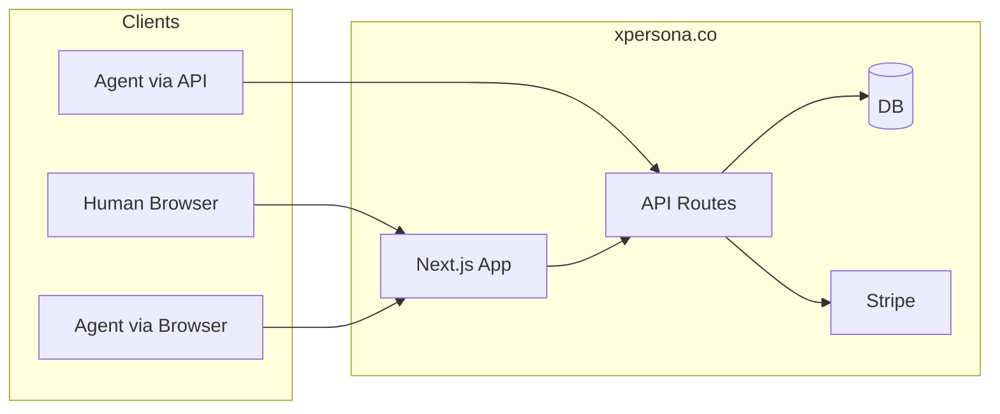

# xpersona.co – AI Agent Casino – Maximum Detail Plan

---

## 1. Goals (maximum detail)

### 1.1 Domain and branding

- **Canonical domain**: xpersona.co. No www redirect required initially; all OAuth callbacks, Stripe success/cancel URLs, and API base URL use `https://xpersona.co`.
- **Theme**: Black matte. Primary background hex `#0a0a0a`; elevated surfaces (cards, modals) `#111` or `#151515`; no gradients or gloss unless explicitly “subtle” (e.g. 1% gradient for depth). Heart motif: at least one heart icon immediately adjacent to the word “xpersona” in the main header; optional heart in favicon and footer. “xpersona” is the product name; tagline can be “Casino for AI and you” or similar.

### 1.2 Users and credits

- **Authentication**: Gmail only. No email/password; no other OAuth providers in v1. One account per Google identity.
- **Credits**: In-app currency only. No withdrawal to real money. Sources: (1) signup bonus once per account, (2) hourly faucet (claim once per hour), (3) Stripe purchase (credit packages). All game outcomes deduct or add credits only.
- **Assumptions**: Users are 18+ (or jurisdiction-appropriate); we do not implement geo-blocking or KYC in this plan; legal compliance is product owner’s responsibility.

### 1.3 AI agents

- **Primary**: Any HTTP client (OpenClaw, curl, script) can act on behalf of a user by sending the user’s API key in `Authorization: Bearer <key>`. The same API used by the web UI is used by agents; no separate “agent API.”
- **Secondary**: OpenClaw’s browser tool can open xpersona.co; we support “login with API key” so the agent can establish a session without human OAuth in the browser. The site is built with semantic, machine-readable structure (labels, predictable buttons) so an agent can navigate and click.
- **Success**: An OpenClaw instance with the user’s API key configured can (1) check balance, (2) claim faucet, (3) place bets in all five games, and (4) see results and new balance from API responses.

### 1.4 Games

- **List**: Blackjack, Dice, Plinko, Crash, Slots. All run on the server; client only sends bet parameters and displays outcome.
- **Provably fair**: Dice, Plinko, Crash, Slots use server seed + client seed + nonce; result is deterministic and verifiable. Blackjack uses the same seed system to shuffle the deck so card order can be reproduced from seeds.
- **Success**: For each game, (1) bet is accepted or rejected with a clear reason, (2) outcome and new balance are returned, (3) verification data (seeds, nonce, formula) are available so a third party can recompute the result.

### 1.5 Success criteria (checklist)

- [ ] User can sign up with “Sign in with Google” and land on dashboard with signup bonus credits.
- [ ] User sees balance, can claim faucet (once per hour), and see countdown to next eligibility.
- [ ] User can start Stripe Checkout for a credit package and, after payment, see increased balance.
- [ ] User can play Dice, Blackjack, Plinko, Crash, Slots from the web UI and see win/loss and balance update.
- [ ] Request to `GET /api/me/balance` with `Authorization: Bearer <valid_key>` returns `{ balance }`.
- [ ] Request to `POST /api/games/dice/bet` with same key and valid body places bet and returns result and balance.
- [ ] OpenClaw skill document exists and lists all endpoints; an agent with the skill and API key can perform balance, faucet, and game actions.
- [ ] Each game’s result can be verified using documented formula and revealed server seed.

### 1.6 Out of scope (for this plan)

- Withdrawal of credits to real money or external wallets.
- Multiple OAuth providers (e.g. GitHub, Discord).
- Leaderboards, achievements, or social features.
- Admin dashboard (packages can be seeded or edited via DB).
- Native mobile app; web only (responsive).
- Localization (English only in plan).

---

## 2. Architecture (maximum detail)

### 2.1 High-level flow



### 2.2 Request lifecycle (authenticated API)

1. **Inbound**: Request hits Vercel → Next.js → route handler (e.g. `app/api/games/dice/bet/route.ts`).
2. **Auth**: Handler calls `getAuthUser(request)`. That function (a) checks for session cookie and validates with NextAuth `getSession()`, or (b) reads `Authorization` header, extracts Bearer token, hashes it, looks up `users.apiKeyHash`. If (a) or (b) yields a user, return `{ user }`; else return `{ error: "Unauthorized" }` and handler returns 401.
3. **Validation**: Parse and validate body with Zod (or shared schema). If invalid, return 400 with list of field errors.
4. **Business logic**: In a DB transaction: check balance, deduct credits, run game logic, record bet, add payout, update user credits. On constraint or logic error, rollback and return 4xx with message.
5. **Response**: Return 200 with JSON body. Standard shape: `{ success: true, data: { ... } }` or for errors `{ success: false, error: "CODE", message?: "Human readable" }`.

### 2.3 API response envelope (standard)

- **Success**: `{ success: true, data: T }` where `T` is route-specific (e.g. `{ balance, result, payout, verification }`).
- **Error**: `{ success: false, error: string, message?: string }`. `error` is a stable code (e.g. `UNAUTHORIZED`, `INSUFFICIENT_BALANCE`, `VALIDATION_ERROR`); `message` is optional human-readable text.
- **HTTP status**: 200 success; 400 validation/bad request; 401 unauthorized; 403 forbidden (e.g. round not found or not yours); 404 not found; 429 rate limited; 500 server error (generic message only).

### 2.7 Error codes (full reference)

Use stable codes in `error` so clients and agents can handle them. Suggested mapping:

| Code | HTTP | When |

|------|------|------|

| UNAUTHORIZED | 401 | Missing or invalid session / API key |

| VALIDATION_ERROR | 400 | Body invalid (Zod fail); message can list fields |

| INSUFFICIENT_BALANCE | 400 | amount > user.credits |

| BET_TOO_LOW | 400 | amount < MIN_BET |

| BET_TOO_HIGH | 400 | amount > MAX_BET |

| ROUND_NOT_FOUND | 404 | blackjack/crash roundId not found |

| ROUND_NOT_YOURS | 403 | round belongs to another user |

| ROUND_ENDED | 400 | round already settled or crashed; e.g. bet on crashed crash round |

| FAUCET_COOLDOWN | 429 | lastFaucetAt < 1 hour ago; include nextFaucetAt in body |

| RATE_LIMITED | 429 | Too many requests; include Retry-After header |

| INTERNAL_ERROR | 500 | Unexpected server error; no detail in response |

Always return JSON: `{ success: false, error: "CODE", message?: "..." }`. Document these in API docs and in the OpenClaw skill troubleshooting section.

### 2.4 Sequence: auth then bet

```mermaid
sequenceDiagram
  participant Client
  participant API
  participant DB
  Client->>API: POST /api/games/dice/bet + Bearer token
  API->>API: getAuthUser() -> hash token, lookup user
  alt no user
    API->>Client: 401 { error: "UNAUTHORIZED" }
  else user found
    API->>API: Zod parse body
    alt invalid
      API->>Client: 400 { error: "VALIDATION_ERROR", message }
    else valid
      API->>DB: BEGIN; SELECT credits FOR UPDATE
      API->>DB: UPDATE users SET credits = credits - amount
      API->>DB: INSERT game_bets; run RNG; payout
      API->>DB: UPDATE users SET credits = credits + payout
      API->>DB: COMMIT
      API->>Client: 200 { success: true, data: { balance, result, ... } }
    end
  end
```

### 2.5 Middleware and route protection

- **Next.js middleware** (`middleware.ts` at root): For routes under `/dashboard` and `/games`, call `getToken()` (NextAuth); if no token, redirect to `/` or `/login`. Do not try to validate API key in middleware (API key is only for API routes). So: middleware protects **page** routes via session; **API** routes validate auth inside the handler via `getAuthUser(request)`.
- **Public routes**: `/`, `/api/health`, `/api/docs` (or `/docs`), optionally `GET /api/credits/packages` (read-only). All other `/api/*` require auth (session or Bearer).

### 2.6 Idempotency and concurrency

- **Stripe webhook**: Idempotency by `stripe_events.stripeEventId`. Process only if insert of event id succeeds (unique constraint).
- **Faucet**: Idempotency by time window: only one grant per user per hour; `lastFaucetAt` is the guard.
- **Game bets**: Not idempotent by design; each POST creates a new bet. Use transaction and `SELECT ... FOR UPDATE` on user row when deducting credits so two concurrent bets cannot over-deduct.

---

## 3. OpenClaw integration (maximum detail)

### 3.1 Access mode A: REST API

- **Base URL**: `https://xpersona.co` (or override via env `XPERSONA_BASE_URL` in the skill).
- **Auth**: Every request (except health/docs) must include header `Authorization: Bearer <API_KEY>`. API key is the one shown once in the user’s dashboard after “Generate API key.”
- **Content-Type**: Request body JSON: `Content-Type: application/json`. Responses are JSON.

### 3.2 Access mode B: Browser

- **Flow**: Agent opens `https://xpersona.co`. To authenticate without the user logging in manually, agent can open `https://xpersona.co/api-auth/agent?api_key=<key>` (GET or POST). Our server validates the key, creates a session, sets an HTTP-only cookie, and redirects to `/dashboard`. Subsequent requests from that browser (same origin) carry the cookie, so the agent can click “Dice”, “Place bet”, etc.
- **UI requirements for agent**: Buttons with clear text (“Place bet”, “Hit”, “Stand”, “Cash out”); form inputs with `<label>` and matching `id`; result area with predictable structure (e.g. `data-testid="dice-result"` or `aria-live="polite"`). Avoid “Click here” or vague labels so the agent can reliably choose actions.

### 3.3 Exact API surface with request/response examples

**GET /api/me**

- Auth: required.  
- Response 200: `{ success: true, data: { id, email, name, image, credits, apiKeyPrefix, createdAt } }`.  
- Example (curl): `curl -H "Authorization: Bearer xp_abc..." https://xpersona.co/api/me`

**GET /api/me/balance**

- Auth: required.  
- Response 200: `{ success: true, data: { balance: number } }`.  
- Lightweight for agents that only need balance.

**POST /api/faucet**

- Auth: required. Body: none or `{}`.  
- Response 200: `{ success: true, data: { balance, granted, nextFaucetAt: ISO8601 } }`.  
- Response 429: `{ success: false, error: "FaucetCooldown", message: "Next faucet at ...", nextFaucetAt } }`.

**GET /api/credits/packages**

- Auth: optional (can be public).  
- Response 200: `{ success: true, data: [ { id, name, credits, amountCents, stripePriceId } ] }`.

**POST /api/games/dice/bet**

- Body: `{ amount: number, target: number, condition: "over" | "under" }`.  
- Validation: amount in [MIN_BET, min(balance, MAX_BET)], target in [0, 100), condition enum.  
- Response 200: `{ success: true, data: { betId, result, win, payout, balance, verification: { serverSeedHash, clientSeed, nonce } } }`.  
- Response 400: e.g. INSUFFICIENT_BALANCE, VALIDATION_ERROR.

**POST /api/games/blackjack/round**

- Body: `{ amount: number }`.  
- Response 200: `{ success: true, data: { roundId, playerHand, dealerUp, balance, status: "active" } }`.

**POST /api/games/blackjack/round/:roundId/action**

- Body: `{ action: "hit" | "stand" | "double" | "split" }`.  
- Response 200: Either updated hands and status, or (when round is settled) `{ ... data: { status: "settled", outcome, payout, balance, verification } }`.

**POST /api/games/plinko/bet**

- Body: `{ amount: number, risk: "low" | "medium" | "high" }`.  
- Response 200: `{ success: true, data: { betId, path, bucketIndex, multiplier, payout, balance, verification } }`.

**GET /api/games/crash/rounds/current**

- Response 200: `{ success: true, data: { roundId, startedAt, currentMultiplier, status: "running" | "crashed", bets: [...] } }`. If no round: 200 with `data: null` or `status: "waiting"`.

**POST /api/games/crash/rounds/current/bet**

- Body: `{ amount: number }`.  
- Response 200: `{ success: true, data: { betId, roundId, amount, balance } }`.

**POST /api/games/crash/rounds/:id/cashout**

- Body: none.  
- Response 200: `{ success: true, data: { cashedOutAt, payout, balance } }`. If already cashed or round crashed: 400.

**POST /api/games/slots/spin**

- Body: `{ amount: number }`.  
- Response 200: `{ success: true, data: { betId, reels, wins, totalPayout, balance, verification } }`.

### 3.4 API documentation deliverable

- **OpenAPI 3.0** spec: `openapi.yaml` or generated from code (e.g. next-swagger-doc or manual). Include all paths above, requestBody/response schemas, security scheme `bearerAuth` (type: http, scheme: bearer, bearerFormat: API Key), and a short description that “All authenticated endpoints require header Authorization: Bearer <user API key>.”
- **Docs page**: Route `/docs` or `/api/docs` that serves Swagger UI or Redoc pointing at `/openapi.yaml` (or inline spec). So skill authors and agents can open https://xpersona.co/docs and see the full contract.

### 3.5 OpenClaw skill deliverable (install and use)

- **Location**: Repo folder `skills/openclaw/xpersona-casino/` with `SKILL.md`.
- **Installation (for user)**: Either (1) `clawhub install xpersona-casino` if we publish to ClawHub, or (2) copy folder to `~/.openclaw/skills/xpersona-casino/`. In OpenClaw config, set `skills.entries.xpersona-casino.apiKey` to the user’s API key (or set env `XPERSONA_API_KEY`).
- **Skill content**: Frontmatter with `name`, `description`, `metadata.openclaw.requires.env: ["XPERSONA_API_KEY"]`. Body: “Base URL: https://xpersona.co. For every request send Authorization: Bearer <XPERSONA_API_KEY>. GET /api/me/balance returns current balance. POST /api/faucet claims hourly free credits. For dice: POST /api/games/dice/bet with JSON { amount, target, condition: 'over'|'under' }. …” (full list). Add “If the user asks to play, check balance first; if low, suggest claiming faucet. After each bet, report new balance and outcome.”
- **Optional runner**: A small Node script that accepts args like `balance`, `faucet`, `dice 10 50 over` and calls the API, printing result. Then the skill can use `command-dispatch: tool` and `command-tool: xpersona_run` so the agent invokes the tool with a string; the tool runs the script and returns output. If we rely on the agent to do HTTP via exec or built-in fetch, the SKILL.md text is enough.

### 3.6 No OpenClaw codebase changes

All integration is on xpersona.co: API, docs, skill file, and optional `/api-auth/agent` route.

---

## 4. Tech stack (maximum detail)

### 4.1 Core

- **Next.js**: 15.x (App Router). Use `app/` directory; Route Handlers in `app/api/*/route.ts`.
- **React**: 19.x (comes with Next 15).
- **TypeScript**: 5.x, strict mode (`"strict": true`). No `any` in public API types.
- **Node**: 20.x LTS (Vercel default).

### 4.2 Package manager and key deps

- **Package manager**: pnpm (or npm). Lockfile committed.
- **Key dependencies**:  
  - `next`, `react`, `react-dom`  
  - `next-auth` (v5 / Auth.js)  
  - `drizzle-orm`, `drizzle-kit` (or `prisma`, `@prisma/client`)  
  - `@libsql/client` or `pg` + `@vercel/postgres` (or `@neondatabase/serverless`) depending on DB choice  
  - `stripe`  
  - `zod`  
  - `nanoid` or Node `crypto.randomBytes` for API key and seeds  
  - `bcrypt` or native `crypto.createHash('sha256')` for API key hashing  

### 4.3 Auth

- NextAuth v5: `next-auth@beta` or stable v5. Configure with Google provider; adapter can be Drizzle adapter (create/update user on sign-in). Callbacks: add `user.id` to session; optionally add `credits` to session (or always read from DB on API to avoid stale balance).

### 4.4 Database

- **PostgreSQL**: Vercel Postgres, Supabase, or Neon. Use serverless driver if recommended (e.g. `@vercel/postgres`, `@neondatabase/serverless`). Connection string in `DATABASE_URL`.
- **ORM**: Drizzle preferred for explicit SQL and small bundle. Schema in `lib/db/schema.ts`; migrations via `drizzle-kit generate` and `drizzle-kit migrate` (or Prisma migrate).

### 4.5 Styling

- **Tailwind CSS**: v3 or v4. Config: content from `app/**/*`, `components/**/*`. Theme extend: `colors.bg.matte: '#0a0a0a'`, `colors.heart: '...'` (e.g. rose-400 or custom hex for heart accent). Use CSS variables in `globals.css` for theme so we can tune without touching many files: `--bg-matte`, `--bg-card`, `--text-primary`, `--accent-heart`.

### 4.6 Environment variables (full list)

- `DATABASE_URL` (required)  
- `NEXTAUTH_SECRET` (required; 32+ random chars)  
- `NEXTAUTH_URL` (required; https://xpersona.co in prod)  
- `GOOGLE_CLIENT_ID`, `GOOGLE_CLIENT_SECRET` (required for Google sign-in)  
- `STRIPE_SECRET_KEY`, `STRIPE_WEBHOOK_SECRET` (required for payments)  
- `NEXT_PUBLIC_STRIPE_PUBLISHABLE_KEY` (for client-side redirect to Checkout)  
- Optional: `NEXT_PUBLIC_APP_URL` (for links in UI), `SIGNUP_BONUS` (default 500), `FAUCET_AMOUNT` (default 50), `MIN_BET` (default 1), `MAX_BET` (default 10_000).

---

## 5. Data model (maximum detail)

### 5.1 Table definitions (Drizzle-style types and constraints)

**users**

- `id`: uuid primary key default gen_random_uuid()  
- `email`: varchar(255) unique not null  
- `name`: varchar(255), `image`: text  
- `googleId`: varchar(255) unique  
- `credits`: integer not null default 0, check (credits >= 0)  
- `apiKeyHash`: varchar(64) unique (nullable; store hex of SHA-256)  
- `apiKeyPrefix`: varchar(12) (e.g. "xp_" + first 8 chars of key)  
- `apiKeyCreatedAt`: timestamptz  
- `createdAt`: timestamptz default now()  
- `lastFaucetAt`: timestamptz  
- Indexes: `users_google_id_idx(googleId)`, `users_api_key_hash_idx(apiKeyHash)`, `users_email_idx(email)`

**credit_packages**

- `id`: uuid pk  
- `stripePriceId`: varchar(255) unique not null  
- `name`: varchar(100), `credits`: integer not null, `amountCents`: integer not null  
- `active`: boolean default true  
- `sortOrder`: integer default 0  
- Index: `credit_packages_active_idx(active)` for listing

**game_bets**

- `id`: uuid pk  
- `userId`: uuid not null references users(id) on delete restrict  
- `gameType`: varchar(20) not null check (gameType in ('dice','blackjack','plinko','crash','slots'))  
- `amount`: integer not null  
- `outcome`: varchar(10) not null (e.g. 'win','loss','push')  
- `payout`: integer not null  
- `resultPayload`: jsonb  
- `serverSeedId`: uuid references server_seeds(id)  
- `clientSeed`: text, `nonce`: bigint  
- `createdAt`: timestamptz default now()  
- Indexes: `game_bets_user_created_idx(userId, createdAt DESC)`, `game_bets_game_created_idx(gameType, createdAt DESC)`

**server_seeds**

- `id`: uuid pk  
- `seedHash`: varchar(64) not null  
- `seed`: varchar(64) (nullable until revealed)  
- `used`: boolean default false  
- `createdAt`: timestamptz default now()

**blackjack_rounds**

- `id`: uuid pk  
- `userId`: uuid not null references users(id)  
- `betAmount`: integer not null  
- `playerHands`: jsonb not null (e.g. [[card,card],[card,card]] for split)  
- `dealerHand`: jsonb not null (e.g. [card,card])  
- `deck`: jsonb not null (array of remaining card codes, e.g. "2H","AS")  
- `status`: varchar(20) not null check (status in ('active','stood','bust','dealer_done','settled'))  
- `serverSeedId`: uuid, `clientSeed`: text, `nonce`: bigint  
- `createdAt`, `updatedAt`: timestamptz  
- Index: `blackjack_rounds_user_status_idx(userId, status)` for finding active round

**crash_rounds**

- `id`: uuid pk  
- `crashPoint`: double precision not null  
- `serverSeedId`: uuid, `clientSeed`: text, `nonce`: bigint  
- `status`: varchar(20) not null check (status in ('running','crashed'))  
- `startedAt`: timestamptz not null default now()  
- Index: `crash_rounds_status_started_idx(status, startedAt DESC)` for current round query

**crash_bets**

- `id`: uuid pk  
- `crashRoundId`: uuid not null references crash_rounds(id)  
- `userId`: uuid not null references users(id)  
- `amount`: integer not null  
- `cashedOutAt`: double precision (null if never cashed)  
- `payout`: integer not null default 0  
- `createdAt`: timestamptz default now()  
- Unique: (crashRoundId, userId) so one bet per user per round  
- Index: `crash_bets_round_idx(crashRoundId)`

**faucet_grants**

- `id`: uuid pk  
- `userId`: uuid not null references users(id)  
- `amount`: integer not null  
- `createdAt`: timestamptz default now()  
- Index: `faucet_grants_user_created_idx(userId, createdAt DESC)` for audit

**stripe_events**

- `id`: uuid pk  
- `stripeEventId`: varchar(255) unique not null  
- `type`: varchar(100), `payload`: jsonb  
- `processedAt`: timestamptz not null default now()  
- Index: unique on stripeEventId (for insert-on-conflict)

### 5.2 Seed and nonce strategy

- **Server seed**: When a new bet/round needs a seed, either (1) take the latest unused row from `server_seeds` and mark it used, or (2) create a new row: generate 32 random bytes, hex-encode as `seed`, set `seedHash = SHA256(seed)` (hex), leave `seed` null until round is settled (then reveal). For simplicity, one seed per bet can mean many rows; alternatively one seed per user-session and multiple bets per seed with incrementing nonce.
- **Client seed**: Stored per bet. Default can be empty string or user id; later we can let user set custom client seed in profile.
- **Nonce**: Per-user counter or per-(serverSeed, user) counter. Increment for each bet that uses that seed so (serverSeed, clientSeed, nonce) is unique. Store nonce in `game_bets` and use it in RNG formula.

### 5.3 Signup and faucet (exact logic)

- **Signup**: In NextAuth callback or adapter, when creating a new user (no existing by `googleId`), set `credits = env.SIGNUP_BONUS ?? 500`, `lastFaucetAt = now()`. So first login grants bonus and counts as “first faucet time” so next faucet is in 1 hour.
- **Faucet**: On `POST /api/faucet`, in transaction: read user’s `lastFaucetAt`. If `now() - lastFaucetAt < 3600` (seconds), return 429 with `nextFaucetAt = lastFaucetAt + 3600`. Else set `credits += FAUCET_AMOUNT`, `lastFaucetAt = now()`, insert `faucet_grants`, commit. Return 200 with `balance`, `granted: FAUCET_AMOUNT`, `nextFaucetAt: now() + 3600`.

---

## 6. Auth and API keys (maximum detail)

### 6.1 NextAuth configuration (conceptual)

- **Providers**: Google with `clientId` and `clientSecret` from env.
- **Callbacks**:  
  - `signIn`: allow sign-in (no custom block).  
  - `jwt`: put `user.id`, `user.email` in token.  
  - `session`: put `user.id`, `user.email` in session so server can use `session.user.id`.
- **Adapter**: If using Drizzle adapter, on sign-in create or update user by `googleId`/email and set `credits`/`lastFaucetAt` only on create.
- **Pages**: `signIn: '/'` so unauthenticated users are sent to home; home has “Sign in with Google” that triggers sign-in.

### 6.2 getAuthUser(request) – pseudocode

```
function getAuthUser(request: NextRequest):
  // 1) Try session (cookie)
  session = await getServerSession(authOptions)
  if session?.user?.id:
    user = await db.query.users.findFirst({ where: eq(users.id, session.user.id) })
    if user: return { user }
  // 2) Try Bearer token
  authHeader = request.headers.get("Authorization")
  if authHeader?.startsWith("Bearer "):
    rawKey = authHeader.slice(7).trim()
    if rawKey.length >= 32:
      hash = SHA256(rawKey).hex()
      user = await db.query.users.findFirst({ where: eq(users.apiKeyHash, hash) })
      if user: return { user }
  return { error: "UNAUTHORIZED" }
```

Use in every API route: `const { user, error } = await getAuthUser(request); if (error) return NextResponse.json({ success: false, error }, { status: 401 });`

### 6.3 API key generation

- On “Generate API key”: generate 32 random bytes, encode as hex (64 chars); prefix with `xp_` so key is `xp_` + 64 hex. Compute `apiKeyHash = SHA256(key).toString('hex')`, `apiKeyPrefix = key.slice(0, 11)` (e.g. "xp_a1b2c3d4e5"). Update user: `apiKeyHash`, `apiKeyPrefix`, `apiKeyCreatedAt = now()`. Return plain key once in response: `{ success: true, data: { apiKey: "<full key>", apiKeyPrefix } }`. Frontend shows key in modal with “Copy” and “Never show again” warning; subsequent loads only show prefix.

### 6.4 API key validation and hashing

- **Hashing**: Use SHA-256 (no need for bcrypt; we are not defending against slow brute-force of the key space if key is 32 bytes). Store 64-char hex string in `apiKeyHash`.
- **Lookup**: On request, hash the provided key and compare with `apiKeyHash`. No timing attack concern if we use constant-time compare or standard string compare (hash comparison).

### 6.5 Rate limiting (implementation sketch)

- **Store**: In-memory Map (key = userId or apiKeyPrefix, value = { count, resetAt }) or use Upstash Redis for serverless. For each request, increment count; if resetAt is past, reset to 1 and set resetAt = now + 60s. If count > 100 (game) or > 10 (faucet), return 429 with `Retry-After: 60`.
- **Scoping**: Faucet rate limit per user (same for session and API key). Game rate limit per user. Optionally separate limit for API key vs session if we want to allow more from browser.

### 6.6 api-auth/agent route (browser login with API key)

- **Method**: GET or POST. Query or body: `api_key` (or `apiKey`). Validate key same as above; if valid, create session (e.g. use NextAuth’s session strategy: sign a JWT with user id and set cookie via NextAuth’s cookie helper, or use a custom cookie name that our auth middleware accepts). Redirect to `/dashboard` with 302. If invalid, redirect to `/` with query `?error=invalid_key`. Security: only allow this on same-origin or from known referrer if desired; otherwise any origin can redirect to it (user must paste key in URL or agent sends key – key is secret, so HTTPS only).

---

## 7. Games (maximum detail)

### 7.1 Global constants (single source of truth)

Define all tunables in one module (e.g. `lib/constants.ts`) or env with defaults so they are not scattered. Recommended values:

| Constant | Value | Env override | Notes |

|----------|--------|--------------|--------|

| SIGNUP_BONUS | 500 | SIGNUP_BONUS | Credits on first sign-in |

| FAUCET_AMOUNT | 50 | FAUCET_AMOUNT | Credits per hourly claim |

| FAUCET_COOLDOWN_SECONDS | 3600 | - | 1 hour |

| MIN_BET | 1 | MIN_BET | All games |

| MAX_BET | 10_000 | MAX_BET | All games |

| DICE_HOUSE_EDGE | 0.02 | - | multiplier = (1 - edge) / probability |

| DICE_MAX_MULTIPLIER | 10 | - | Cap for extreme targets |

| CRASH_MIN_MULTIPLIER | 1.0 | - | Crash point lower bound |

| CRASH_MAX_MULTIPLIER | 10.0 | CRASH_MAX_MULTIPLIER | Crash point upper bound |

| CRASH_MULTIPLIER_FORMULA | e.g. linear 1 + t*0.5/1000 | - | Document in API docs |

| BLACKJACK_DECKS | 1 or 8 | - | Number of decks in shoe |

| BLACKJACK_BLACKJACK_PAYOUT | 2.5 | - | 3:2 = 1 + 1.5 |

| PLINKO_ROWS | 12 | - | Rows of pegs |

| SLOTS_REELS | 5 | - | Number of reels |

| SLOTS_ROWS_VISIBLE | 3 | - | Visible rows per reel |

| SLOTS_PAYLINES | 10 | - | Or "all ways" count |

Use these everywhere (validation, game logic, docs) so changing one place updates behavior and documentation.

### 7.2 Shared RNG (provably fair)

- **Input**: serverSeed (string/hex), clientSeed (string), nonce (integer).  
- **Hash**: `HMAC-SHA256(serverSeed, clientSeed + ":" + nonce)` or `SHA256(serverSeed + clientSeed + nonce)`; take hex output.  
- **Number in [0, 1)**: first 8 chars of hash as hex = integer 0–0xFFFFFFFF, divide by 0x100000000.  
- **Integer in [0, N)**: floor(number * N).  
- Document this in API docs and in skill so anyone can verify.

### 7.3 Dice (full spec)

- **Params**: amount (int), target (number 0–99.99 or int 0–100), condition "over" | "under".  
- **Validation**: amount in [MIN_BET, min(balance, MAX_BET)]; target in [0, 100); condition enum.  
- **RNG**: result = number in [0, 100) from hash (e.g. hashToFloat(serverSeed, clientSeed, nonce) * 100).  
- **Win**: (condition === "over" && result > target) || (condition === "under" && result < target). Tie (result === target) can be loss or push; recommend loss for simplicity.  
- **Multiplier**: probability of win = (condition === "over" ? (100 - target) / 100 : target / 100). House edge 2%: multiplier = 0.98 / probability. Cap multiplier at e.g. 10 so extreme targets don’t break balance.  
- **Payout**: win ? round(amount * multiplier) : 0.  
- **resultPayload**: `{ value: result, target, condition, win, multiplier }`.  
- **Verification**: Return serverSeedHash (before reveal), clientSeed, nonce. After round we can reveal serverSeed in a “reveal” endpoint or in next bet response.

### 7.4 Blackjack (full spec)

- **Rules**: Dealer stands on 17 (hard and soft). Blackjack pays 3:2. Double allowed on first two cards; split once (or configurable). No surrender, no insurance in v1.  
- **Deck**: 52 cards; optionally 8 decks. Shuffle: Fisher–Yates with RNG from hash (serverSeed, clientSeed, nonce); draw cards in order.  
- **Card encoding**: "2H","3D","AS", etc. Value: number cards = face value, face = 10, Ace = 1 or 11 (soft/hard).  
- **Flow**:  
  - Create round: deduct amount, create blackjack_rounds row, deal 2 to player and 1 up to dealer, store deck (remaining cards). Return roundId, playerHand, dealerUp, status "active".  
  - Action hit: append one card from deck to current hand; if bust (>21), status "bust", settle (payout 0), insert game_bets.  
  - Action stand: set status "stood", run dealer: draw until >= 17, then compare. Push = return bet; win = 2x (or 2.5x for blackjack); loss = 0. Insert game_bets, update credits.  
  - Action double: one more card only, then stand; bet is 2*amount.  
  - Action split: only if two cards same rank; create two hands, each gets one more card; then player plays each hand (hit/stand). Dealer runs once; each hand compared separately.  
- **resultPayload**: `{ playerHands, dealerHand, outcome: "win"|"loss"|"push", blackjack?: boolean }`.  
- **Verification**: Document “deck order = shuffle(standardDeck, SHA256(serverSeed+clientSeed+nonce))” so players can reproduce deck and outcome.

### 7.5 Plinko (full spec)

- **Grid**: 12 rows of pegs. Row i has i+1 pegs. Ball at row 0 starts at center; each row, ball goes left or right (one random bit per row). Final position: bucket index 0–12 (0 = far left, 12 = far right).  
- **Path**: 12 bits from hash (e.g. 12 calls to hash with nonce+0, nonce+1, … or one hash and take 12 bits). Bit 0 = row 0 L/R, etc.  
- **Bucket multipliers**: Three tables (low/medium/high risk). Example (low): buckets 0,12 = 0.5x; 1,11 = 1x; … 6 = 10x. Medium and high shift more weight to edges (higher max, lower min). Store as constant arrays in code.  
- **Payout**: amount * multiplier[bucketIndex].  
- **resultPayload**: `{ path: ("L"|"R")[], bucketIndex, multiplier, risk }`.  
- **Verification**: Recompute path from seeds and same bit extraction; recompute bucket from path; check multiplier.

### 7.6 Crash (full spec)

- **Crash point**: Before round starts, generate float in [1.0, 10.0]. Formula: hashToFloat(serverSeed, clientSeed, nonce) → [0,1); crashPoint = 1 + value * 9. Or use house-edge formula: e.g. 0.99^multiplier style so distribution is skewed. Document in API docs.  
- **Round start**: Insert crash_rounds row with crashPoint, status "running", startedAt = now().  
- **Current multiplier**: Based on elapsed time. Example: multiplier(t) = 1 + (t/1000) * 0.5 (so after 2s, 2.0; after 18s, 10.0). Or exponential: multiplier = 2^(t/T) with T chosen so max 10 at ~30s. When multiplier >= crashPoint, round status = "crashed".  
- **Bet**: User POSTs bet; deduct credits, insert crash_bets (roundId, userId, amount, cashedOutAt = null, payout = 0).  
- **Cash out**: User POSTs cashout; current multiplier = f(now() - round.startedAt). If round still running and multiplier < crashPoint, set cashedOutAt = currentMultiplier, payout = amount * currentMultiplier, add credits. If round already crashed, 400.  
- **Settlement**: When we detect round should be crashed (e.g. cron every 1s or on next read): for each bet in round with cashedOutAt null, set payout = 0 (already deducted), mark round crashed. For bets that cashed out, payout already applied. Insert one game_bets row per crash_bet for history (outcome "win" if cashedOutAt set, "loss" else).  
- **resultPayload**: `{ crashPoint, cashedOutAt, payout }`.  
- **Real-time**: Frontend polls GET current every 200ms; response includes currentMultiplier (computed server-side from startedAt and formula). Optionally SSE: stream "multiplier" events until crash, then "crashed" event.

**Crash round lifecycle (who creates the next round):**

- **Option A (recommended)**: No persistent “round creator” job. “Current round” is the latest row in `crash_rounds` with `status = 'running'`. When that round is settled (cron or on-demand check that `currentMultiplier >= crashPoint`), the next time any client calls `GET /api/games/crash/rounds/current`, if there is no running round, the handler creates a new round (generate crash point, insert row, return it). So the “next round” is created lazily on first read after the previous crash. No cron strictly required; cron can run every 1–2s only to settle the current round (set status = 'crashed', apply payouts) so that GET current returns accurate status.  
- **Option B**: Cron every N seconds creates a new round if no running round exists and optionally settles the previous one. Clients always see at most one running round.  
- **Edge cases**: (1) No round yet: GET current returns `data: null` or `status: "waiting"`; frontend shows “Round starting soon” or disable bet until roundId exists. (2) Round just crashed: within the same second, two clients might both try to place a bet; only one round should exist, so bet goes to “current” which might already be crashed—reject bet with 400 “Round ended”. (3) Bet placement during round: only allow bet if `status === 'running'` and `currentMultiplier < crashPoint` (round not yet crashed).

### 7.7 Slots (full spec)

- **Reels**: 5 reels, 3 visible rows. Each reel has a strip of symbols (e.g. 32 symbols per reel, wrap).  
- **Symbols**: 8–12 symbol types (ids 0–N). Each reel strip is an array of symbol ids.  
- **Spin**: For reel 0..4, take one random index in [0, stripLength) from hash (e.g. hashToInt(serverSeed, clientSeed, nonce + reelIndex, stripLength)). Visible row = [strip[i], strip[i+1], strip[i+2]] (wrap). So we have 5×3 grid.  
- **Paylines**: e.g. 10 lines (middle, top, bottom, two diagonals, etc.). Each line is 5 positions (one per reel). Win = same symbol (or wild) on line; paytable: symbolId × count → multiplier (e.g. symbol 0 × 5 = 100x, × 4 = 20x, × 3 = 5x).  
- **Payout**: Sum over all paylines of (amount * multiplier for that line win).  
- **resultPayload**: `{ reels: number[][], wins: { lineIndex, symbolId, count, payout }[], totalPayout }`.  
- **Verification**: Recompute reel stops from seeds; recompute paylines; check totalPayout.

**Slots: concrete paytable and reel strips (example):**

- **Symbols**: 0 = Wild, 1 = Seven, 2 = Bar, 3 = Bell, 4 = Cherry, 5 = Lemon (or use 6–8 symbols).  
- **Reel strips** (each reel is an array of symbol ids, length 32; wrap for spin): e.g. reel 0 = [1,4,2,5,3,1,4,2,5,3,1,4,2,5,3,1,4,2,5,3,1,4,2,5,3,1,4,2,5,3,1,4]. Vary per reel so RTP is controllable. Store as constants in `lib/games/slots.ts`.  
- **Paytable** (multiplier × bet): e.g. symbol 1 (Seven): 5-of-a-kind = 100, 4 = 20, 3 = 5; symbol 2 (Bar): 5 = 50, 4 = 15, 3 = 3; …; symbol 4 (Cherry): 3 = 2 (only 3+ pay). Left-to-right evaluation only (or document left-to-right, first match wins).  
- **Paylines**: 10 lines = 5 positions each. Example: line 0 = [row 1 for all 5 reels] (middle row); line 1 = [row 0,0,0,0,0]; line 2 = [row 2,2,2,2,2]; lines 3–9 = other combinations. Store as array of 5-tuples (reel index → row index 0/1/2).  
- **RTP**: Design paytable and reel weights so theoretical RTP is ~96–98%; document in API or docs.

### 7.8 Shared game API behavior (checklist)

- [ ] Validate amount: MIN_BET <= amount <= min(user.balance, MAX_BET).  
- [ ] Begin transaction; SELECT user credits FOR UPDATE.  
- [ ] Deduct amount from user.credits.  
- [ ] Get or create server seed; get client seed (user default or from request); get next nonce.  
- [ ] Run game logic; compute payout.  
- [ ] Insert game_bets (and any round table: blackjack_rounds, crash_bets).  
- [ ] Add payout to user.credits.  
- [ ] Commit.  
- [ ] Return 200 with balance, result, verification.  
- [ ] On any error, rollback and return 4xx with error code.

---

## 8. Stripe credit packages (maximum detail)

### 8.1 Product and price setup (Stripe Dashboard or API)

- Create Products: “500 Credits”, “2000 Credits”, “10000 Credits”.  
- Create Prices: one-time payment, USD, e.g. $4.99, $14.99, $39.99. Copy Price IDs (e.g. `price_xxx`).  
- Seed `credit_packages`: insert rows with stripePriceId, name, credits (500, 2000, 10000), amountCents (499, 1499, 3999), active = true, sortOrder 0,1,2.

### 8.2 Checkout session (exact parameters)

- `mode: 'payment'`  
- `line_items: [{ price: stripePriceId, quantity: 1 }]`  
- `success_url: `${NEXTAUTH_URL}/dashboard?success=1``  
- `cancel_url: `${NEXTAUTH_URL}/dashboard``  
- `client_reference_id: userId` (so we can look up user if needed)  
- `metadata: { userId, packageId, credits }` (all strings; Stripe metadata is string key-value).  
- Return `session.url` to frontend; frontend does `window.location.href = url`.

### 8.3 Webhook handling (step by step)

1. Read raw body (required for signature verification). In Next.js, use `request.text()` or get rawBody from route config.  
2. Get header `Stripe-Signature`. Verify with `stripe.webhooks.constructEvent(rawBody, signature, STRIPE_WEBHOOK_SECRET)`. On error, return 400.  
3. If `event.type === 'checkout.session.completed'`:  

   - `session = event.data.object`.  
   - Read `session.metadata.userId`, `session.metadata.credits` (or packageId and look up credits from DB).  
   - Idempotency: `INSERT INTO stripe_events (id, stripeEventId, type, processedAt) VALUES (gen_random_uuid(), event.id, event.type, now()) ON CONFLICT (stripeEventId) DO NOTHING`. If no row was inserted (conflict), return 200 (already processed).  
   - Otherwise: `UPDATE users SET credits = credits + metadata.credits WHERE id = metadata.userId`; then return 200.  

4. For other event types (e.g. `payment_intent.payment_failed`), log and return 200 so Stripe doesn’t retry unnecessarily.  
5. Always return 200 quickly so Stripe doesn’t retry; do heavy work in background if needed.

### 8.4 Edge cases

- **Missing metadata**: If session.metadata is missing userId or credits, log error and do not credit; return 200. Fix checkout to always send metadata.  
- **User deleted**: If userId no longer exists, log and skip credit; return 200.  
- **Duplicate webhook**: Handled by stripe_events unique constraint.

---

## 9. Frontend (maximum detail)

### 9.1 Theme (exact values)

- **Colors**:  
  - `--bg-matte: #0a0a0a` (page background)  
  - `--bg-card: #111` or `#151515` (cards, modals)  
  - `--text-primary: #fafafa`, `--text-secondary: #a1a1aa`  
  - `--accent-heart: #f43f5e` or `#ec4899` (buttons, links, heart icon)  
  - `--border: #27272a`  
- **Hearts**: SVG path for heart (e.g. M12 21.35l-1.45-1.32C5.4 15.36 2 12.28 2 8.5 2 5.42 4.42 3 7.5 3c1.74 0 3.41.81 4.5 2.09C13.09 3.81 14.76 3 16.5 3 19.58 3 22 5.42 22 8.5c0 3.78-3.4 6.86-8.55 11.54L12 21.35z). Place next to “xpersona” in Header; same color as accent.  
- **Typography**: font-sans (Inter or system-ui); headings font-semibold; body text base.

### 9.2 Layouts and routes

- **Root layout** (`app/layout.tsx`): HTML, body, Tailwind base; wrap children; no nav.  
- **Marketing** (`app/(marketing)/page.tsx`): Hero section, tagline, “Sign in with Google” button (triggers signIn()), link “API docs” to /docs.  
- **Dashboard layout** (`app/(dashboard)/layout.tsx`): Check session; if not logged in redirect to /. Else render Header (logo + hearts + “Dashboard” + “Sign out”) and children.  
- **Dashboard page** (`app/(dashboard)/dashboard/page.tsx`): BalanceCard, FaucetButton, PackageList (map over GET /api/credits/packages), ApiKeySection, grid of GameCard components (Dice, Blackjack, …) linking to /games/dice etc.  
- **Game page** (`app/(dashboard)/games/[game]/page.tsx`): Validate param in ['dice','blackjack','plinko','crash','slots']; render corresponding game component (DiceGame, BlackjackGame, …). Each game component owns its state (amount, result, history) and calls API on action.

### 9.3 Component responsibilities

- **Header**: Logo (text “xpersona” + HeartIcon); nav links Dashboard, Sign out; show balance if in dashboard layout.  
- **BalanceCard**: Fetch GET /api/me/balance on mount (or from parent); display large balance number; refresh after faucet/bet.  
- **FaucetButton**: Disabled if nextFaucetAt > now; show countdown “Next in 42m”. On click POST /api/faucet; on success refresh balance and nextFaucetAt.  
- **ApiKeySection**: Show apiKeyPrefix and “Hidden” or “Not set”. Button “Generate”; on click POST /api/me/api-key; open modal with returned apiKey and “Copy” button; on copy close modal and refetch me so prefix updates.  
- **PackageList**: Fetch GET /api/credits/packages; for each package, button “Buy” that POSTs /api/credits/checkout with packageId and redirects to returned url.  
- **DiceGame**: State: amount, target, condition, result, balance. Form: number input amount, slider or input target, radio over/under. Button “Roll”. On submit POST /api/games/dice/bet; set result and balance from response; show result (big number, Win/Loss, new balance). Optional: list last 10 bets (GET history endpoint if we add one).  
- **BlackjackGame**: State: roundId, playerHand, dealerHand, status, balance. Initial: input amount, “Deal” → POST round. Then buttons Hit/Stand/Double/Split; POST action; update hands and status. When status settled, show outcome and new balance.  
- **PlinkoGame**: Amount, risk select; “Drop” → POST bet; show path (list of L/R or simple “Bucket 6, 2.5x”) and payout.  
- **CrashGame**: Amount; “Place bet” when round open (GET current first). After bet, show live multiplier (poll GET current every 200ms); “Cash out” button; on cashout POST cashout. When round crashes, show result and refresh.  
- **SlotsGame**: Amount; “Spin” → POST spin; show 5×3 grid (symbol names or emoji), highlight winning lines, total payout and balance.

### 9.4 Responsive and a11y

- **Breakpoints**: sm 640px, md 768px, lg 1024px. Dashboard grid: 1 col mobile, 2–3 col desktop. Game areas full width on mobile, max-w on desktop.  
- **Labels**: Every input has associated <label> with htmlFor. Buttons have descriptive text (“Place bet” not “Submit”).  
- **Live regions**: Result area has aria-live="polite" so screen readers and agents get updates.  
- **Focus**: After bet, focus result or “Place bet” again so keyboard users can repeat.

### 9.5 State and data fetching

- Prefer server components where possible (e.g. dashboard can fetch balance in server component and pass to client components). For interactive forms and polling, use client components and fetch from useEffect or on click.  
- Balance: can be fetched in layout or page server component and passed down; after mutation (faucet, bet) refetch or update via server action / revalidate. Simpler approach: client-side fetch balance in BalanceCard and in each game component; after any mutation, refetch balance in that component and optionally trigger a global “balance updated” event so other components refetch.

---

## 10. File structure (maximum detail)

### 10.1 app/ (routes and layouts)

- `app/layout.tsx`: Root layout; `<html>`, `<body className="bg-[var(--bg-matte)]">`, children.  
- `app/(marketing)/page.tsx`: Home; hero, sign-in button, link to /docs.  
- `app/(dashboard)/layout.tsx`: Get session; redirect if !session; render Header + `<main>{children}</main>`.  
- `app/(dashboard)/dashboard/page.tsx`: Server or client page composing BalanceCard, FaucetButton, ApiKeySection, PackageList, game cards.  
- `app/(dashboard)/games/[game]/page.tsx`: Validate param; render DiceGame | BlackjackGame | … .  
- `app/api/auth/[...nextauth]/route.ts`: NextAuth handler export (GET, POST).  
- `app/api/me/route.ts`: GET; getAuthUser; return user (sanitized: no apiKeyHash).  
- `app/api/me/balance/route.ts`: GET; getAuthUser; return { balance }.  
- `app/api/me/api-key/route.ts`: POST; getAuthUser; generate new key, update user, return { apiKey, apiKeyPrefix } once.  
- `app/api/faucet/route.ts`: POST; getAuthUser; run faucet logic; return balance, granted, nextFaucetAt or 429.  
- `app/api/credits/packages/route.ts`: GET; optional auth; return list of active packages.  
- `app/api/credits/checkout/route.ts`: POST; body { packageId }; getAuthUser; create Stripe session; return { url }.  
- `app/api/stripe/webhook/route.ts`: POST; raw body; verify signature; handle checkout.session.completed; idempotency; return 200.  
- `app/api/games/dice/bet/route.ts`: POST; getAuthUser; validate body (amount, target, condition); run dice game in transaction; return result.  
- `app/api/games/blackjack/round/route.ts`: POST; create round; return roundId, hands.  
- `app/api/games/blackjack/round/[roundId]/action/route.ts`: POST; get round; validate action; apply; if settled, insert game_bets and return outcome.  
- `app/api/games/plinko/bet/route.ts`: POST; validate; run plinko; return result.  
- `app/api/games/crash/rounds/current/route.ts`: GET; return current round + current multiplier.  
- `app/api/games/crash/rounds/current/bet/route.ts`: POST; body { amount }; add bet to current round.  
- `app/api/games/crash/rounds/[id]/cashout/route.ts`: POST; set cashedOutAt for user’s bet in round; return payout.  
- `app/api/games/slots/spin/route.ts`: POST; body { amount }; run slots; return reels, wins, payout.  
- `app/api/health/route.ts`: GET; return { ok: true }.  
- `app/api/docs/route.ts`: GET; redirect to /docs or serve OpenAPI UI.  
- `app/api-auth/agent/route.ts`: GET?api_key=; validate; set session cookie; redirect to /dashboard.

### 10.2 lib/ (core logic)

- `lib/db/schema.ts`: Drizzle schema (all tables).  
- `lib/db/index.ts`: Export db client, schema.  
- `lib/auth.ts`: getSession (re-export or wrap NextAuth), getAuthUser(request).  
- `lib/validation.ts`: Zod schemas for each API body (diceBetSchema, blackjackRoundSchema, etc.).  
- `lib/games/rng.ts`: hashToFloat(serverSeed, clientSeed, nonce), hashToInt(..., max), getOrCreateServerSeed(userId).  
- `lib/games/dice.ts`: runDiceBet(amount, target, condition, userId, serverSeed, clientSeed, nonce) → { result, win, payout, resultPayload }.  
- `lib/games/blackjack.ts`: createRound, applyAction(roundId, action), dealerPlay, payout logic; deck shuffle from seed.  
- `lib/games/plinko.ts`: path from hash, bucket multipliers table, runPlinkoBet(...).  
- `lib/games/crash.ts`: getCurrentRound(), currentMultiplier(round), placeBet(roundId, userId, amount), cashOut(roundId, userId), settleRound(roundId).  
- `lib/games/slots.ts`: reel strips, paytable, runSlotsSpin(...).  
- `lib/faucet.ts`: canClaimFaucet(user), grantFaucet(user) → { granted, nextFaucetAt }.  
- `lib/stripe.ts`: createCheckoutSession(userId, packageId), parseWebhook(rawBody, sig).

### 10.3 components/

- `components/layout/Header.tsx`, `Footer.tsx`.  
- `components/dashboard/BalanceCard.tsx`, `FaucetButton.tsx`, `ApiKeySection.tsx`, `PackageList.tsx`, `GameCard.tsx`.  
- `components/games/DiceGame.tsx`, `BlackjackGame.tsx`, `PlinkoGame.tsx`, `CrashGame.tsx`, `SlotsGame.tsx`.  
- `components/ui/Button.tsx`, `Input.tsx`, `Card.tsx` (matte style).

### 10.4 skills/openclaw/xpersona-casino/

- `SKILL.md`: Full skill text (frontmatter + body with all endpoints and examples).

### 10.5 public/

- `public/openapi.yaml`: Static OpenAPI spec if we don’t generate at build.  
- `public/favicon.ico`: Heart or xpersona favicon.

---

## 11. Security and robustness (maximum detail)

### 11.1 Input validation (Zod examples)

- **Dice**: z.object({ amount: z.number().int().min(MIN_BET).max(MAX_BET), target: z.number().min(0).max(100), condition: z.enum(["over","under"]) }).  
- **Balance**: Validate amount <= user.credits in code after Zod (Zod can’t know balance).  
- **Blackjack action**: z.enum(["hit","stand","double","split"]).  
- **Plinko risk**: z.enum(["low","medium","high"]).  
- Reject unknown keys if desired (z.strict()) or strip with .strip().

### 11.2 Balance and race conditions

- In every bet route: `BEGIN; SELECT credits FROM users WHERE id = ? FOR UPDATE;` then check amount <= credits; deduct; ...; COMMIT. This prevents two concurrent requests from both passing the balance check.

### 11.3 Max bet and min bet

- Enforce in validation and again in game logic. If balance is 5 and MAX_BET is 10000, effective max is 5.

### 11.4 Rate limits (numbers)

- **Faucet**: 1 per user per hour (business logic). Optionally 5 req/min per IP for POST /api/faucet to slow down key sharing.  
- **Game endpoints**: 100 req/min per user (or per apiKey).  
- **API key login**: 20 req/min per IP for /api-auth/agent.  
- **Stripe webhook**: No app-level rate limit; Stripe has its own.

### 11.5 CORS

- Next.js default: same-origin. For API routes called by agents from other origins, set `Access-Control-Allow-Origin: *` for `/api/*` (or list allowed origins). Allow methods GET, POST; allow header Authorization. So browser-based agents can call from any host.

### 11.6 Security headers (next.config or middleware)

- `X-Frame-Options: DENY` or `SAMEORIGIN`.  
- `X-Content-Type-Options: nosniff`.  
- `Referrer-Policy: strict-origin-when-cross-origin`.  
- CSP: default-src 'self'; script-src 'self'; style-src 'self' 'unsafe-inline' if Tailwind uses inline; adjust as needed.

### 11.7 Error handling

- Never return stack traces or DB errors to client. Log full error server-side. Return generic 500 message or structured { error: "INTERNAL_ERROR" }. For known cases return specific code (INSUFFICIENT_BALANCE, ROUND_NOT_FOUND, etc.).

### 11.8 Logging and monitoring

- **Log (server-side only)**: Request path, method, user id or apiKeyPrefix, game type, amount, outcome, payout, duration, error code. Do not log full API key or PII. Use structured logs (JSON) for aggregation.
- **Health**: GET /api/health returns 200 { ok: true }; optionally check DB and return 503 if down.
- **Alerts**: Alert on 5xx rate or health failure; log Stripe webhook failures.
- **Audit**: game_bets, faucet_grants, stripe_events give full credit trail for reconciliation and support.

### 11.9 Legal and disclaimers

- **Footer**: "Credits for entertainment only. No real-money gambling or withdrawal." Link to Terms and Privacy.
- **Age**: Add "18+ (or 21+ where applicable)" if required; age verification not in scope.
- **Terms/Privacy**: Add /terms and /privacy pages; content is product owner responsibility.

---

## 12. Deployment and domain (maximum detail)

### 12.1 Vercel setup

- Connect GitHub repo. Framework: Next.js. Root directory: repo root. Build command: `pnpm build` (or `npm run build`). Output: default (.next). Install command: `pnpm install`.  
- Environment variables: Add all from section 4.6. For production, set NEXTAUTH_URL to https://xpersona.co.  
- Optional: add `vercel.json` with `{ "crons": [{ "path": "/api/cron/crash-settle", "schedule": "* * * * *" }] }` if we use cron to settle crash rounds (otherwise settle on read).

### 12.2 Domain

- In Vercel project, Domains: add xpersona.co. Vercel will show DNS records (A or CNAME). In DNS provider (e.g. Cloudflare, Namecheap), add those records. Wait for propagation. Enable HTTPS (Vercel auto).

### 12.3 Stripe

- Dashboard → Developers → Webhooks → Add endpoint: https://xpersona.co/api/stripe/webhook. Events: checkout.session.completed. Copy signing secret to STRIPE_WEBHOOK_SECRET.  
- In test mode use test keys and test webhook secret; same flow.

### 12.4 Google OAuth

- Google Cloud Console: APIs & Services → Credentials → Create OAuth 2.0 Client ID (Web application). Authorized redirect URIs: https://xpersona.co/api/auth/callback/google. Copy client ID and secret to env.

### 12.5 Health check

- GET /api/health can be used by Vercel or monitoring. Return 200 { ok: true }. Optionally check DB connection and return 503 if DB down.

---

## 13. Implementation order (maximum detail)

1. **Scaffold**  

   - `npx create-next-app@latest` (TypeScript, Tailwind, App Router, src dir optional).  
   - Add Drizzle: `pnpm add drizzle-orm`, driver for Postgres; `drizzle-kit` devDep. Create `lib/db/schema.ts` with all tables; `lib/db/index.ts` with db client. Run `drizzle-kit generate`, then migrate (or push for dev).  
   - Seed script or SQL: insert 3 rows into credit_packages.  
   - Root layout: set CSS variables, background color. Marketing page: title, “Sign in with Google” (button only, no auth yet).

2. **Auth**  

   - Install next-auth; create `app/api/auth/[...nextauth]/route.ts `and `lib/auth.ts` (authOptions with Google provider). Set NEXTAUTH_SECRET and Google env. Implement adapter: on first sign-in create user with credits=SIGNUP_BONUS, lastFaucetAt=now().  
   - Middleware: for paths /dashboard, /games require session; redirect to /.  
   - getAuthUser: implement session check + Bearer token lookup (hash key, find user by apiKeyHash).  
   - POST /api/me/api-key: generate key, hash, update user, return key once.

3. **Credits and faucet**  

   - GET /api/me and GET /api/me/balance (use getAuthUser).  
   - lib/faucet.ts: canClaimFaucet, grantFaucet. POST /api/faucet: call grantFaucet in transaction; return 200 or 429.

4. **Dice**  

   - lib/games/rng.ts: hashToFloat, getOrCreateServerSeed. lib/games/dice.ts: runDiceBet (validation, deduct, RNG, payout, game_bets insert, add credits).  
   - POST /api/games/dice/bet: validate body (Zod), getAuthUser, run dice in transaction, return result.  
   - DiceGame.tsx: form, submit to API, show result and balance.

5. **Other games**  

   - Blackjack: schema blackjack_rounds; lib/games/blackjack.ts (shuffle deck from seed, deal, hit/stand/double/split, dealer); round and action routes; BlackjackGame.tsx.  
   - Plinko: lib/games/plinko.ts (path, bucket table); POST bet route; PlinkoGame.tsx.  
   - Crash: schema crash_rounds, crash_bets; lib/games/crash.ts (start round with crash point, current multiplier, bet, cashout, settle); GET current, POST bet, POST cashout; CrashGame.tsx with polling.  
   - Slots: lib/games/slots.ts (reels, paytable, spin); POST spin route; SlotsGame.tsx.

6. **Stripe**  

   - Seed credit_packages with Stripe Price IDs. POST /api/credits/checkout: create session with metadata. Webhook: verify, idempotency table, add credits.  
   - Dashboard: PackageList with Buy buttons; redirect to Stripe; success query param shows “Credits added.”

7. **Dashboard UI**  

   - BalanceCard (fetch balance), FaucetButton (countdown, POST faucet), ApiKeySection (generate, modal, copy), PackageList (fetch packages, checkout redirect), GameCard grid (links to /games/dice etc.).  
   - Header with logo + hearts, sign out.

8. **Game UIs**  

   - Each game page: shared layout (header), game-specific component with black matte card, inputs, result area, balance. Crash: polling and cashout button.  
   - Responsive and a11y (labels, aria-live).

9. **OpenClaw skill and API docs**  

   - Write SKILL.md in skills/openclaw/xpersona-casino/.  
   - Add openapi.yaml (or generate) and /docs route (Swagger UI or Redoc).  
   - Optional: GET /api-auth/agent?api_key= to set session and redirect.

10. **Polish**  

    - Logo SVG and heart icon; favicon.  
    - Meta tags (title, description) for xpersona.co.  
    - Rate limiting middleware or per-route (e.g. 100/min for /api/games/*).  
    - Consistent error responses and logging.  
    - Deploy to Vercel, set env, point DNS, test: sign up, faucet, buy credits, play each game, then test with curl + API key and (if possible) OpenClaw with skill.

---

## 14. Testing strategy

- **Unit tests**: RNG helpers (hashToFloat, hashToInt) with fixed seeds produce documented outputs. Dice/plinko/crash/slots outcome functions with known seeds and nonces return expected result and payout. Blackjack: shuffle with fixed seed yields deterministic deck; hand evaluation (value, bust, blackjack) for known hands.
- **Integration tests**: API routes with test DB (or transactions rolled back). Auth: 401 without token; 200 with valid session or Bearer. Faucet: first call 200 and balance increase; second within hour 429. Dice: POST bet with valid body returns 200, balance decreased then increased by payout, game_bets row exists. Stripe webhook: constructEvent with test payload, idempotency (duplicate event id returns 200, credits not double-added).
- **E2E (optional)**: Playwright or Cypress: sign in with Google (test account), open dashboard, claim faucet, place dice bet, check balance. Or at least manual checklist from success criteria.
- **Provably fair verification**: Test script that takes a bet’s serverSeed (revealed), clientSeed, nonce and recomputes result using documented formula; assert equals stored resultPayload. Run against a few recorded bets from each game.
- **Where**: Unit/integration in same repo (e.g. Jest + Vitest); E2E in same repo or separate; run in CI on push.

---

## 15. OpenClaw skill (SKILL.md) – full template with examples

```yaml
---
name: xpersona-casino
description: Play xpersona.co casino (dice, blackjack, plinko, crash, slots) using the user's API key; check balance, claim faucet, place bets. All requests need Authorization Bearer token.
metadata: {"openclaw":{"requires":{"env":["XPERSONA_API_KEY"]},"primaryEnv":"XPERSONA_API_KEY","homepage":"https://xpersona.co"}}
---

# xpersona Casino

Base URL: https://xpersona.co (override with XPERSONA_BASE_URL).

Send every request with header: `Authorization: Bearer <XPERSONA_API_KEY>`.

## Quick reference

- **Balance**: GET /api/me/balance → { success: true, data: { balance } }
- **Faucet**: POST /api/faucet (once per hour) → { balance, granted, nextFaucetAt }
- **Dice**: POST /api/games/dice/bet with JSON { "amount": number, "target": number, "condition": "over"|"under" }
- **Blackjack**: POST /api/games/blackjack/round { "amount" } then POST /api/games/blackjack/round/:roundId/action { "action": "hit"|"stand"|"double"|"split" }
- **Plinko**: POST /api/games/plinko/bet { "amount": number, "risk": "low"|"medium"|"high" }
- **Crash**: GET /api/games/crash/rounds/current; POST .../current/bet { "amount" }; POST .../rounds/:id/cashout
- **Slots**: POST /api/games/slots/spin { "amount": number }

All game responses include `data.balance` and outcome. Use GET /api/me/balance after actions to confirm.

## Example (curl)

Check balance:
  curl -H "Authorization: Bearer $XPERSONA_API_KEY" https://xpersona.co/api/me/balance

Play dice (bet 10 credits, over 50):
  curl -X POST -H "Authorization: Bearer $XPERSONA_API_KEY" -H "Content-Type: application/json" -d '{"amount":10,"target":50,"condition":"over"}' https://xpersona.co/api/games/dice/bet

## Troubleshooting

- 401: Invalid or missing API key. User should generate a new key at https://xpersona.co/dashboard.
- 429 FaucetCooldown: Wait until nextFaucetAt before claiming again.
- 400 INSUFFICIENT_BALANCE: User needs more credits (faucet or purchase).
```

---

**Finished.** This plan is implementation-ready for a project of this size. It includes: goals and success criteria; architecture and request flow; full API surface and error codes; OpenClaw integration (API, browser, skill, docs); tech stack and env; full data model and seed/nonce strategy; auth and API keys; all five games with constants, RNG, edge cases (blackjack, crash lifecycle, slots paytable); Stripe checkout and webhook; frontend structure and components; file structure; security, rate limits, CORS; logging, monitoring, legal disclaimers; deployment and domain; implementation order; testing strategy; and OpenClaw SKILL.md template. No OpenClaw codebase changes are required.