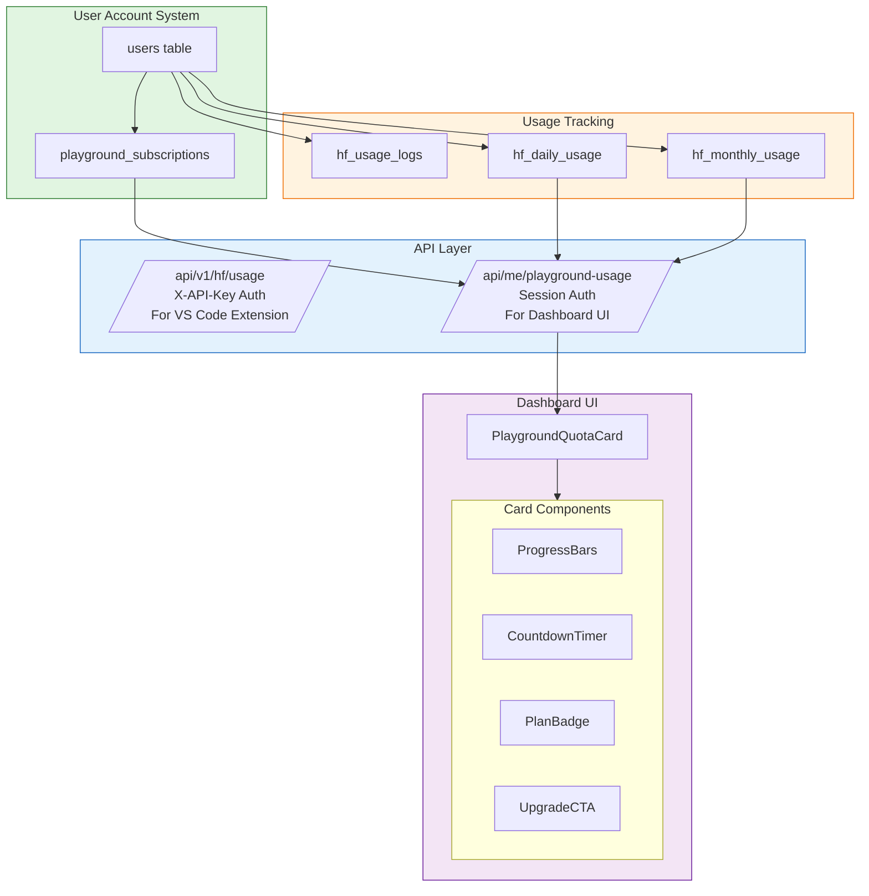
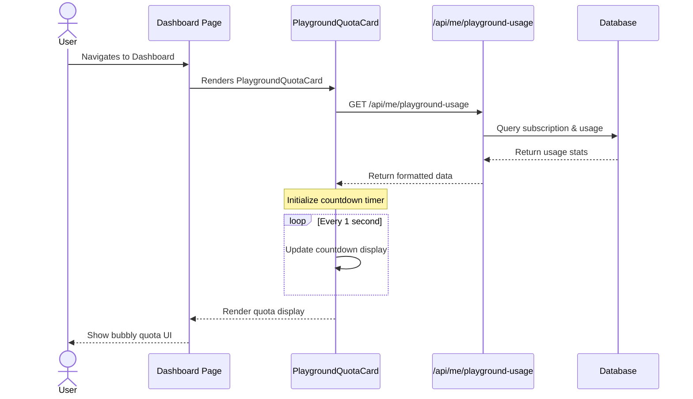
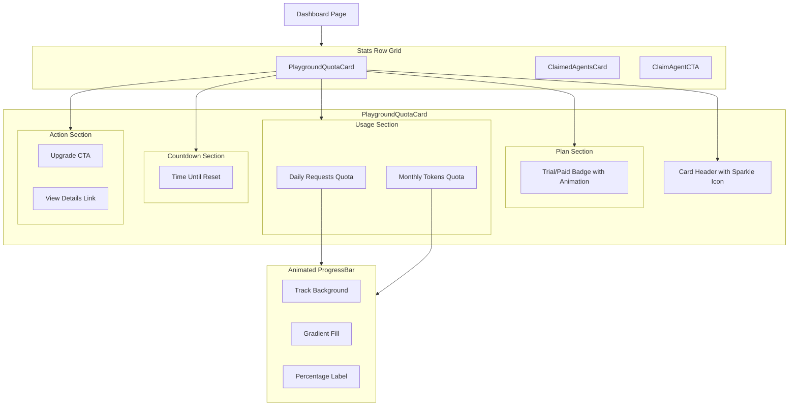
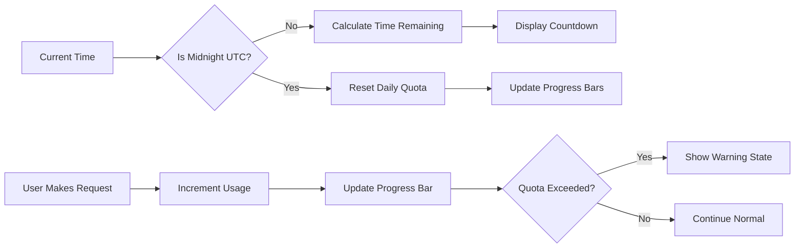
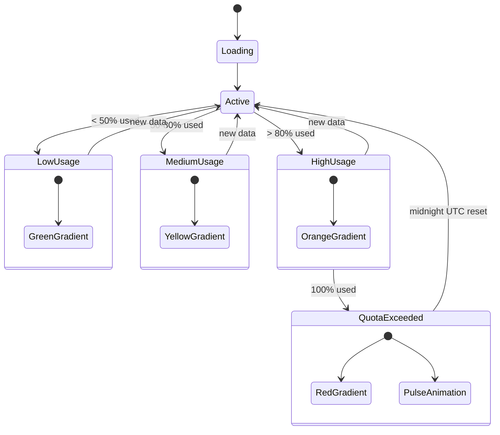
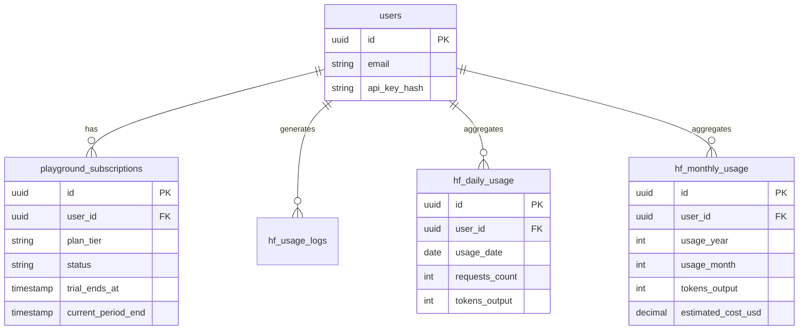

# HF Router Dashboard UI - Architecture Diagram

## System Architecture

```mermaid
flowchart TB
    subgraph UserAccount["User Account System"]
        U[users table]
        PS[playground_subscriptions]
        U --> PS
    end

    subgraph UsageTracking["Usage Tracking"]
        HUL[hf_usage_logs]
        HDU[hf_daily_usage]
        HMU[hf_monthly_usage]
        U --> HUL
        U --> HDU
        U --> HMU
    end

    subgraph API["API Layer"]
        EXT[/api/v1/hf/usage\nX-API-Key Auth\nFor VS Code Extension/]
        DASH[/api/me/playground-usage\nSession Auth\nFor Dashboard UI/]
    end

    subgraph DashboardUI["Dashboard UI"]
        PQC[PlaygroundQuotaCard]
        subgraph CardComponents["Card Components"]
            PB[ProgressBars]
            CT[CountdownTimer]
            PBADGE[PlanBadge]
            UPGRADE[UpgradeCTA]
        end
        PQC --> CardComponents
    end

    PS --> DASH
    HDU --> DASH
    HMU --> DASH
    DASH --> PQC

    style UserAccount fill:#e1f5e1,stroke:#2e7d32
    style UsageTracking fill:#fff3e0,stroke:#ef6c00
    style API fill:#e3f2fd,stroke:#1565c0
    style DashboardUI fill:#f3e5f5,stroke:#6a1b9a
```

## Data Flow

```mermaid
sequenceDiagram
    actor User
    participant Dashboard as Dashboard Page
    participant Card as PlaygroundQuotaCard
    participant API as /api/me/playground-usage
    participant DB as Database

    User->>Dashboard: Navigates to Dashboard
    Dashboard->>Card: Renders PlaygroundQuotaCard
    Card->>API: GET /api/me/playground-usage
    API->>DB: Query subscription & usage
    DB-->>API: Return usage stats
    API-->>Card: Return formatted data
    
    Note over Card: Initialize countdown timer
    
    loop Every 1 second
        Card->>Card: Update countdown display
    end
    
    Card-->>Dashboard: Render quota display
    Dashboard-->>User: Show bubbly quota UI
```

## Component Hierarchy

```mermaid
graph TD
    DashboardPage[Dashboard Page]
    
    subgraph StatsRow["Stats Row Grid"]
        PQC[PlaygroundQuotaCard]
        CC[ClaimedAgentsCard]
        CAC[ClaimAgentCTA]
    end
    
    subgraph PlaygroundQuotaCard["PlaygroundQuotaCard"]
        Header[Card Header with Sparkle Icon]
        
        subgraph PlanSection["Plan Section"]
            PlanBadge[Trial/Paid Badge with Animation]
        end
        
        subgraph UsageSection["Usage Section"]
            DailyQuota[Daily Requests Quota]
            MonthlyQuota[Monthly Tokens Quota]
        end
        
        subgraph CountdownSection["Countdown Section"]
            ResetTimer[Time Until Reset]
        end
        
        subgraph ActionSection["Action Section"]
            UpgradeButton[Upgrade CTA]
            ViewDetails[View Details Link]
        end
    end
    
    subgraph ProgressBar["Animated ProgressBar"]
        Track[Track Background]
        Fill[Gradient Fill]
        Label[Percentage Label]
    end

    DashboardPage --> StatsRow
    PQC --> Header
    PQC --> PlanSection
    PQC --> UsageSection
    PQC --> CountdownSection
    PQC --> ActionSection
    DailyQuota --> ProgressBar
    MonthlyQuota --> ProgressBar
```

## Quota Reset Logic

```mermaid
flowchart LR
    A[Current Time] --> B{Is Midnight UTC?}
    B -->|No| C[Calculate Time Remaining]
    C --> D[Display Countdown]
    B -->|Yes| E[Reset Daily Quota]
    E --> F[Update Progress Bars]
    
    G[User Makes Request] --> H[Increment Usage]
    H --> I[Update Progress Bar]
    I --> J{Quota Exceeded?}
    J -->|Yes| K[Show Warning State]
    J -->|No| L[Continue Normal]
```

## Visual States

```mermaid
stateDiagram-v2
    [*] --> Loading
    Loading --> Active
    
    Active --> LowUsage: < 50% used
    Active --> MediumUsage: 50-80% used
    Active --> HighUsage: > 80% used
    
    LowUsage --> Active: new data
    MediumUsage --> Active: new data
    HighUsage --> Active: new data
    
    HighUsage --> QuotaExceeded: 100% used
    QuotaExceeded --> Active: midnight UTC reset
    
    state LowUsage {
        [*] --> GreenGradient
    }
    
    state MediumUsage {
        [*] --> YellowGradient
    }
    
    state HighUsage {
        [*] --> OrangeGradient
    }
    
    state QuotaExceeded {
        [*] --> RedGradient
        [*] --> PulseAnimation
    }
```

## Database Relationships

```mermaid
erDiagram
    users ||--o{ playground_subscriptions : has
    users ||--o{ hf_usage_logs : generates
    users ||--o{ hf_daily_usage : aggregates
    users ||--o{ hf_monthly_usage : aggregates
    
    users {
        uuid id PK
        string email
        string api_key_hash
    }
    
    playground_subscriptions {
        uuid id PK
        uuid user_id FK
        string plan_tier
        string status
        timestamp trial_ends_at
        timestamp current_period_end
    }
    
    hf_daily_usage {
        uuid id PK
        uuid user_id FK
        date usage_date
        int requests_count
        int tokens_output
    }
    
    hf_monthly_usage {
        uuid id PK
        uuid user_id FK
        int usage_year
        int usage_month
        int tokens_output
        decimal estimated_cost_usd
    }
```
