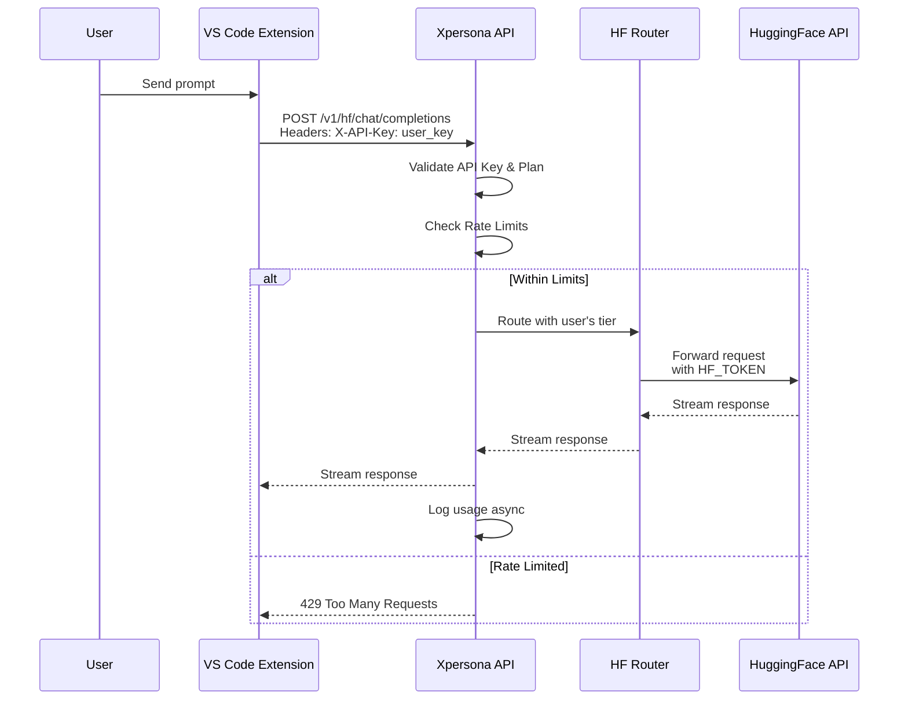

# HuggingFace Inference Router Architecture Plan

## Overview
Build a routing layer for HuggingFace inference API that distributes requests from a single master account to multiple user accounts based on Playground subscription tiers.

## Architecture Options

### Option A: Master Key Proxy with User Quotas (Recommended)
All requests use your single `HF_TOKEN` with user-specific rate limiting and usage tracking.

```
User Request → Xpersona API Key → Router → HF Inference API
                                    ↓
                              Usage Tracking
                              Rate Limit Check
                              Plan Tier Validation
```

**Pros:**
- Simple account management
- Centralized billing control
- Easy to implement quotas per plan tier
- No need to manage multiple HF accounts

**Cons:**
- Single point of failure (one HF token)
- All costs centralized on your account
- HF rate limits apply to all users collectively

### Option B: User-Provided HF Keys with Routing
Users provide their own HF API keys, Xpersona routes and tracks usage.

```
User Request → Xpersona API Key + HF Token → Router → HF Inference API
                                               ↓
                                         Usage Tracking Only
```

**Pros:**
- Costs distributed to users
- No single point of failure
- Users can bring their own HF Pro accounts

**Cons:**
- More complex UX (users need HF account)
- Harder to guarantee service availability
- Multiple token management overhead

### Option C: Hybrid Model (Suggested Implementation)
- **Free/Starter plans**: Use your master HF_TOKEN with quotas
- **Builder/Studio plans**: Can optionally add their own HF keys for unlimited usage

## Database Schema Additions

### 1. Playground Subscriptions Table
```typescript
export const playgroundSubscriptions = pgTable(
  "playground_subscriptions",
  {
    id: uuid("id").primaryKey().defaultRandom(),
    userId: uuid("user_id").notNull().references(() => users.id),
    stripeSubscriptionId: varchar("stripe_subscription_id").unique(),
    planTier: varchar("plan_tier", { length: 20 }).notNull(), // starter | builder | studio
    status: varchar("status", { length: 20 }).notNull().default("active"),
    trialEndsAt: timestamp("trial_ends_at"),
    currentPeriodStart: timestamp("current_period_start"),
    currentPeriodEnd: timestamp("current_period_end"),
    createdAt: timestamp("created_at").defaultNow(),
  }
);
```

### 2. HF Router Accounts Table (for user-provided keys)
```typescript
export const hfRouterAccounts = pgTable(
  "hf_router_accounts",
  {
    id: uuid("id").primaryKey().defaultRandom(),
    userId: uuid("user_id").notNull().references(() => users.id),
    // Encrypted HF API key
    encryptedToken: text("encrypted_token").notNull(),
    tokenPrefix: varchar("token_prefix", { length: 12 }),
    isActive: boolean("is_active").default(true),
    lastUsedAt: timestamp("last_used_at"),
    createdAt: timestamp("created_at").defaultNow(),
  }
);
```

### 3. HF Usage Tracking Table
```typescript
export const hfUsageLogs = pgTable(
  "hf_usage_logs",
  {
    id: uuid("id").primaryKey().defaultRandom(),
    userId: uuid("user_id").notNull().references(() => users.id),
    model: varchar("model", { length: 100 }).notNull(),
    tokensInput: integer("tokens_input"),
    tokensOutput: integer("tokens_output"),
    latencyMs: integer("latency_ms"),
    status: varchar("status", { length: 20 }), // success | error | rate_limited
    errorMessage: text("error_message"),
    requestHash: varchar("request_hash", { length: 64 }), // for idempotency
    createdAt: timestamp("created_at").defaultNow(),
  },
  (table) => [
    index("hf_usage_user_created_idx").on(table.userId, table.createdAt),
    index("hf_usage_model_idx").on(table.model),
  ]
);
```

### 4. Daily Usage Aggregates
```typescript
export const hfDailyUsage = pgTable(
  "hf_daily_usage",
  {
    id: uuid("id").primaryKey().defaultRandom(),
    userId: uuid("user_id").notNull().references(() => users.id),
    date: date("date").notNull(),
    totalRequests: integer("total_requests").default(0),
    totalTokensInput: integer("total_tokens_input").default(0),
    totalTokensOutput: integer("total_tokens_output").default(0),
    estimatedCostUsd: doublePrecision("estimated_cost_usd").default(0),
    uniqueModels: jsonb("unique_models").$type<string[]>(),
  },
  (table) => [
    uniqueIndex("hf_daily_usage_user_date_idx").on(table.userId, table.date),
  ]
);
```

## Plan Tier Configuration

| Feature | Starter ($2) | Builder ($5) | Studio ($10) |
|---------|-------------|--------------|--------------|
| Requests/min | 10 | 60 | 300 |
| Tokens/day | 50K | 500K | 5M |
| Concurrent streams | 1 | 3 | 10 |
| Model access | All | All | All + early access |
| Can add own HF key | No | Yes | Yes |
| Priority routing | Low | Medium | High |

## API Route Structure

```
POST /api/v1/hf/chat/completions     # OpenAI-compatible endpoint
GET  /api/v1/hf/models               # List available models
GET  /api/v1/hf/usage                # User's usage stats
GET  /api/v1/hf/limits               # Current user's rate limits
```

## Authentication Flow



## Implementation Phases

### Phase 1: Core Router (MVP)
1. Database migrations for playground subscriptions
2. Basic OpenAI-compatible proxy endpoint
3. Simple rate limiting (requests per minute)
4. Usage logging

### Phase 2: Plan Integration
1. Stripe webhook integration for plan changes
2. Tier-based rate limits
3. Token quotas per day
4. Usage dashboard for users

### Phase 3: Advanced Features
1. Load balancing across multiple HF accounts (if needed)
2. Smart model routing (fastest vs cheapest)
3. Caching layer for common prompts
4. User-provided HF key support

### Phase 4: Monitoring & Optimization
1. Real-time cost tracking
2. Performance dashboards
3. Automatic failover
4. Usage analytics

## Security Considerations

1. **API Key Storage**: Encrypt all HF tokens at rest
2. **Rate Limiting**: Per-user + global limits to prevent abuse
3. **Request Validation**: Sanitize all inputs before forwarding
4. **Audit Logging**: Full request/response logging for security
5. **Token Rotation**: Support for rotating HF tokens without downtime

## Cost Estimation

Based on HF Inference pricing (~$0.001-0.01 per 1K tokens):
- Starter (50K tokens/day): ~$0.05-0.50/day per user
- Builder (500K tokens/day): ~$0.50-5.00/day per user  
- Studio (5M tokens/day): ~$5.00-50.00/day per user

Revenue per user:
- Starter: $2/month = ~$0.07/day
- Builder: $5/month = ~$0.17/day
- Studio: $10/month = ~$0.33/day

**Recommendation**: Set quotas lower than max theoretical usage to ensure profitability, or require users on higher tiers to bring their own HF keys after a threshold.

## Next Steps

Please clarify:
1. Which architecture option do you prefer?
2. Do you have a specific HF Pro/Business account for this?
3. Should we integrate with existing Xpersona credits system or keep separate?
4. Any specific models you want to prioritize?
